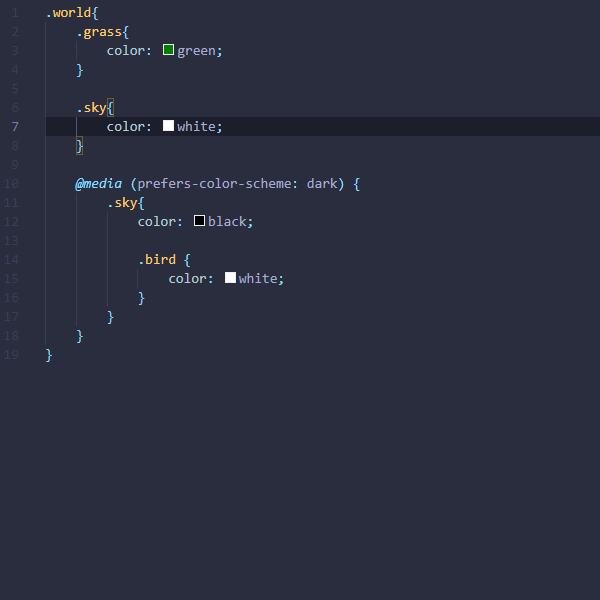

# SCSS Allman Formatter

A simple extension to format SCSS & CSS with the [Allman style](https://en.wikipedia.org/wiki/Indentation_style#Allman_style)

Braces will autoformat to the next line.

```css
.test{
	color: red;
}
```

Becomes

```css
.test
{
	color: red;
}
```

## Demo

