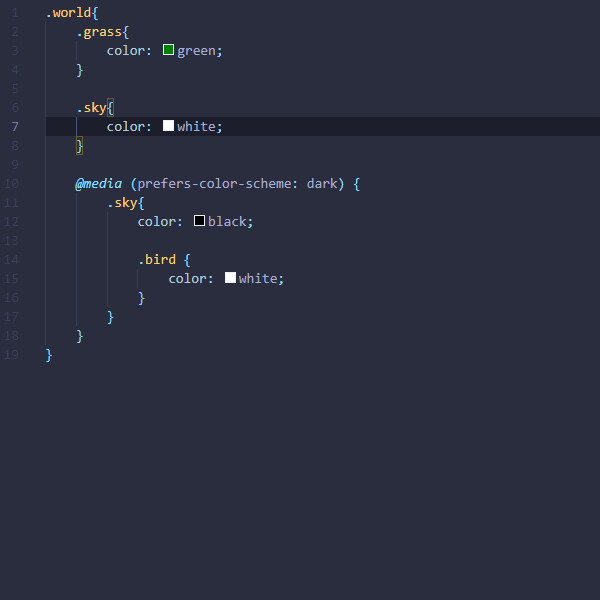

# SCSS Allman Formatter

## Hey 👋
Hey, I'm Grant, A Freelance Software Developer. I help agencies, startups, and individuals stand out by creating exceptional websites, mobile apps, and digital experiences. Based in Surrey, I work with clients in London and internationally, providing flexible, tailored solutions for every project.

If you're looking for a mobile app, a responsive website, or a unique digital solution, I'm here to deliver standout results crafted to your needs.  Say hi 👋  [Get in touch](https://grant-bartlett.com/)


## About SCSS Allman Formatter
A simple extension to format SCSS & CSS with the [Allman style](https://en.wikipedia.org/wiki/Indentation_style#Allman_style)

Braces will autoformat to the next line.

```css
.test{
    color: red;
}
```

Becomes

```css
.test
{
    color: red;
}
```

## Demo

